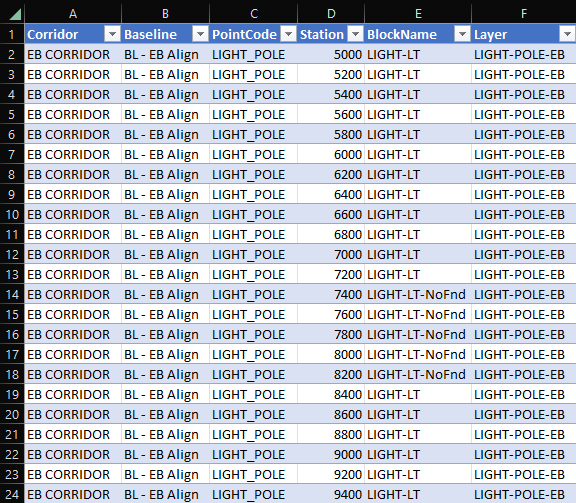
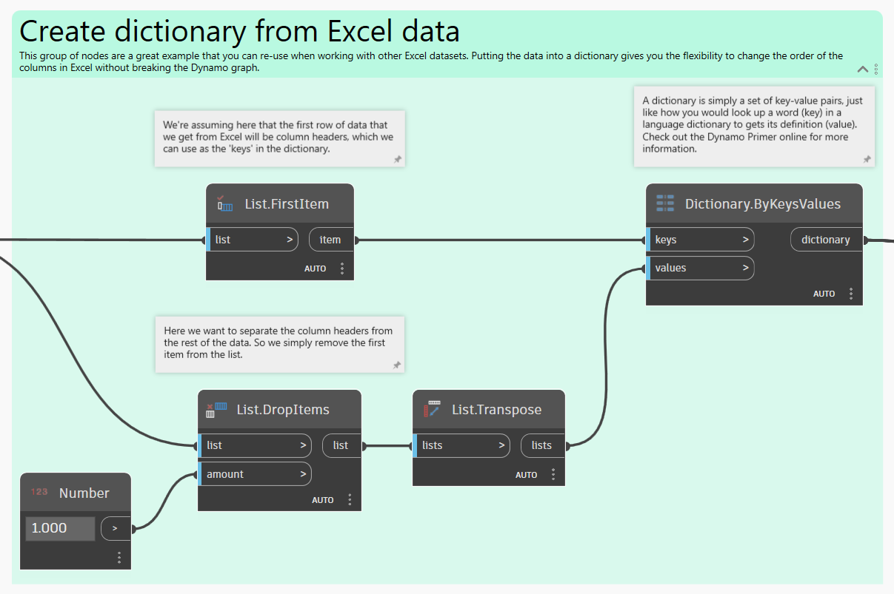
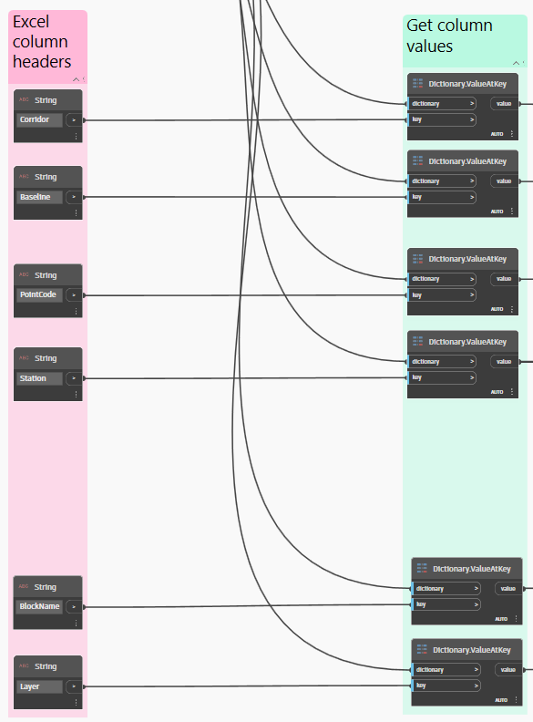
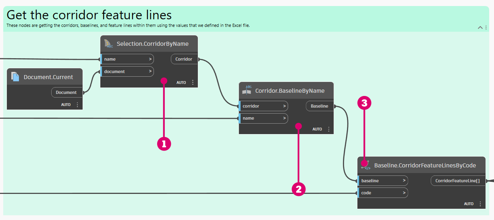
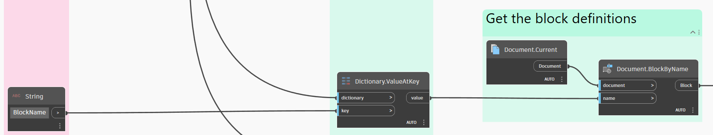
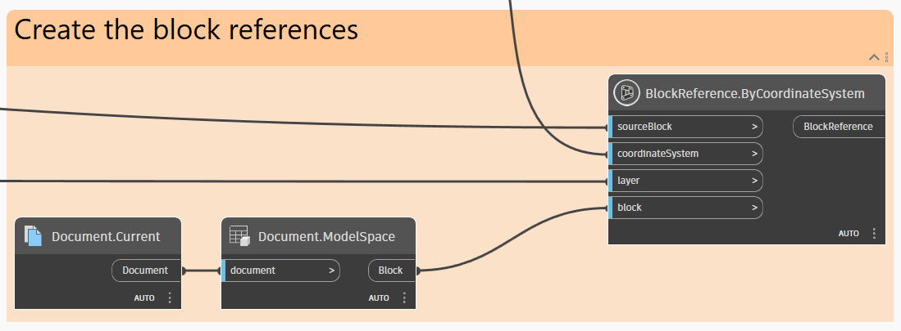
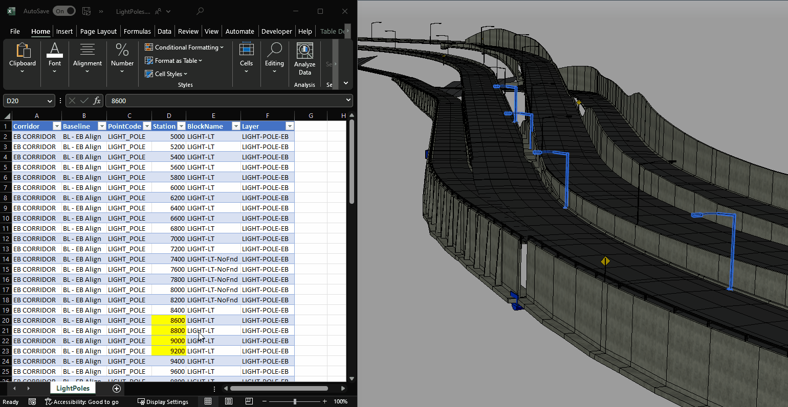
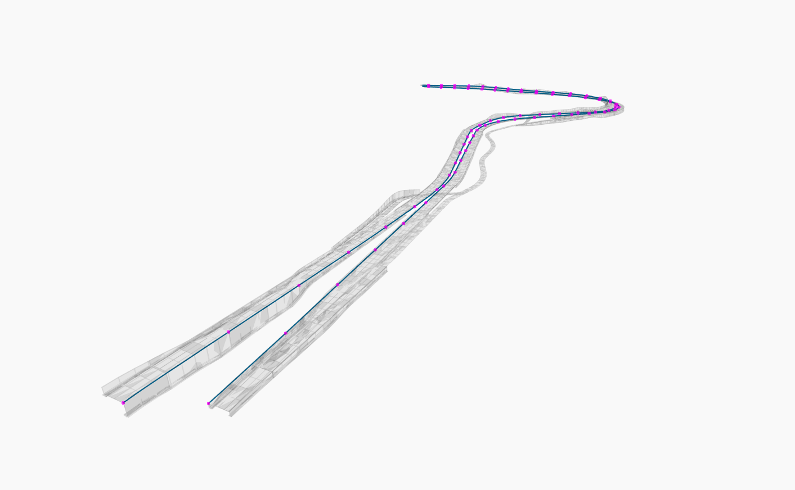

# Light Pole Placement

<figure><figcaption></figcaption></figure>

One of Dynamo's many great use cases is dynamically placing discrete objects along a Corridor model. It is often the case that objects need to be placed at locations that are independent of the inserted Assemblies along the Corridor, which is a very tedious task to accomplish manually. And when the horizontal or vertical geometry of the Corridor changes, then a significant amount of re-work is introduced.

## Goal

> :dart: Place light pole Block References along a Corridor at station values specified in an Excel file.&#x20;

## Key Concepts

> * Reading data from an external file (Excel in this case)
> * Organizing data in Dictionaries
> * Using Coordinate Systems to control position/scale/rotation
> * Placing Block References
> * Visualizing geometry in Dynamo

## Version Compatibility


This graph will run on **Civil 3D 2020** and above.


## Dataset

Start by downloading the sample files below and then opening the DWG file and Dynamo graph.


It is best if the Excel file is saved in the same directory as the Dynamo graph.








## Solution

Here's an overview of the logic in this graph.

> 1. Read the Excel file and import the data into Dynamo
> 2. Get Feature Lines from the specified Corridor Baseline
> 3. Generate Coordinate Systems along the Corridor Feature Line at the desired stations
> 4. Use the Coordinate Systems to place Block References in Model Space

Let's go!

### Get Excel Data

In this example graph, we're going to use an Excel file to store the data that Dynamo will use to place the light pole Block References. The table looks like this.

<figure><figcaption>
The Excel file table structure
</figcaption></figure>


Using Dynamo to read data from an external file (such as an Excel file) is a great strategy, especially when the data needs to be shared with other team members.


The Excel data is imported into Dynamo like this.&#x20;

<figure><figcaption>
Importing the Excel data into Dynamo
</figcaption></figure>

Now that we have the data, we need to split it up by column (_Corridor_, _Baseline_, _PointCode_, etc.) so that it can be used in the rest of the graph. A common way to do this is to use the **List.GetItemAtIndex** node and specify the index number of each column that we want. For example, the _Corridor_ column is at index 0, the _Baseline_ column is at index 1, etc.

Seems fine, right? But there's a potential issue with this approach. What if the order of the columns in the Excel file changes in the future? Or a new column is added between two columns? Then the graph will not function properly and require an update. We can future-proof the graph by putting the data into a **Dictionary**, with the Excel column headers as the _keys_ and the rest of the data as the _values_.


If Dictionaries are new to you, take a look at the [5-5\_dictionaries-in-dynamo](../../../5\_essential\_nodes\_and\_concepts/5-5\_dictionaries-in-dynamo/ "mention") section.


<figure><figcaption>
Putting the Excel data into a Dictionary
</figcaption></figure>

This makes the graph more resilient because it allows for flexibility in changing the order of the columns in Excel. As long as the column headers stay the same, then the data can simply be retrieved from the Dictionary using its _key_ (i.e., the column header), which is what we do next.

<figure><figcaption>
Retrieving data from the Dictionary
</figcaption></figure>

### Get Corridor Feature Lines

Now that we have the Excel data imported and ready to go, let's start using it to get some information from Civil 3D about the Corridor models.

<figure><figcaption></figcaption></figure>

> 1. Select the Corridor model by its name.
> 2. Get a specific Baseline within the Corridor.
> 3. Get a Feature Line within the Baseline by its point code.

### Generate Coordinate Systems

What we're going to do now is generate **Coordinate Systems** along the Corridor Feature Lines at the station values that we specified in the Excel file. These Coordinate Systems will be used to define the position, rotation, and scale of the light pole Block References.


If Coordinate Systems are new to you, take a look at the [2-vectors.md](../../../5\_essential\_nodes\_and\_concepts/5-2\_geometry-for-computational-design/2-vectors.md "mention") section.


<figure><figcaption>
Getting Coordinate Systems along the Corridor Feature Lines
</figcaption></figure>

Note the use of a Code Block here to rotate the Coordinate Systems depending on which side of the baseline they are on. This could be achieved using a sequence of several nodes, but this is a good example of a situation where it's easier to just write it out.


If Code Blocks are new to you, take a look at the [8-1\_code-blocks-and-design-script](../../../8\_coding\_in\_dynamo/8-1\_code-blocks-and-design-script/ "mention") section.


### Create Block References

We're getting close! We have all the information we need to be able to actually place the Block References. The first thing to do is get the Block definitions that we want using the _BlockName_ column in the Excel file.

<figure><figcaption>
Getting the Block definitions that we want from the Document
</figcaption></figure>

From here, the last step is to create the Block References.

<figure><figcaption>
Creating the Block References in Model Space
</figcaption></figure>

### Result

When you run the graph, you should see new Block References show up in Model Space along the Corridor. And here's the cool part - if the graph's execution mode is set to Automatic and you edit the Excel file, the Block References update automatically!


You can read more about graph execution modes in the [3\_user\_interface](../../../3\_user\_interface/ "mention") section.


<figure><figcaption>
Making updates to the Excel file and quickly seeing the results in Civil 3D
</figcaption></figure>

Here's an example of running the graph using **Dynamo Player**.

<figure><figcaption>
Running the graph using Dynamo Player and seeing the results in Civil 3D
</figcaption></figure>


If Dynamo Player is new to you, take a look at the [dynamo-player.md](../../dynamo-player.md "mention") section.


> :tada: Mission accomplished!

### Bonus: Visualizing in Dynamo

It can be helpful to visualize the Corridor geometry in Dynamo to provide context. This particular model has the Corridor solids already extracted in Model Space, so let's bring those into Dynamo.&#x20;

But there's something else we need to consider. Solids are a relatively "heavy" geometry type, which means that this operation will slow down the graph. It would be nice if there was a simple way to _choose_ if we wanted to view the solids or not. The obvious answer is to just unplug the **Corridor.GetSolids** node, but that will produce warnings for all of the downstream nodes, which is a little messy. This is a situation where the **ScopeIf** node really shines.

<figure><figcaption></figcaption></figure>

> 1. Notice that the **Object.Geometry** node has a gray bar at the bottom. This means that the node preview is turned off (accessible by right-clicking on the node), which allows the **GeometryColor.ByGeometryColor** to avoid "fighting" with other geometry for display priority in the background preview.
> 2. The **ScopeIf** node basically allows you to selectively run an entire branch of nodes. If the _test_ input in false, then every node connected to the **ScopeIf** node will not run.

Here's the result in the Dynamo background preview.

<figure><figcaption>
Visualizing the Corridor geometry in Dynamo
</figcaption></figure>

## Ideas

Here are some ideas for how you could expand the capabilities of this graph.


Add a **rotation** column to the Excel file and use it to drive the rotation of the coordinate systems.



Add **horizontal or vertical offsets** to the Excel file so that the light poles could deviate from the Corridor Feature Line if needed.



Instead of using an Excel file with station values, generate the station values **directly in Dynamo** using a start station and typical spacing.

