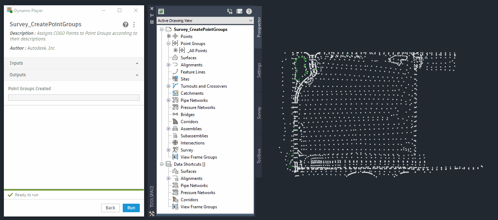
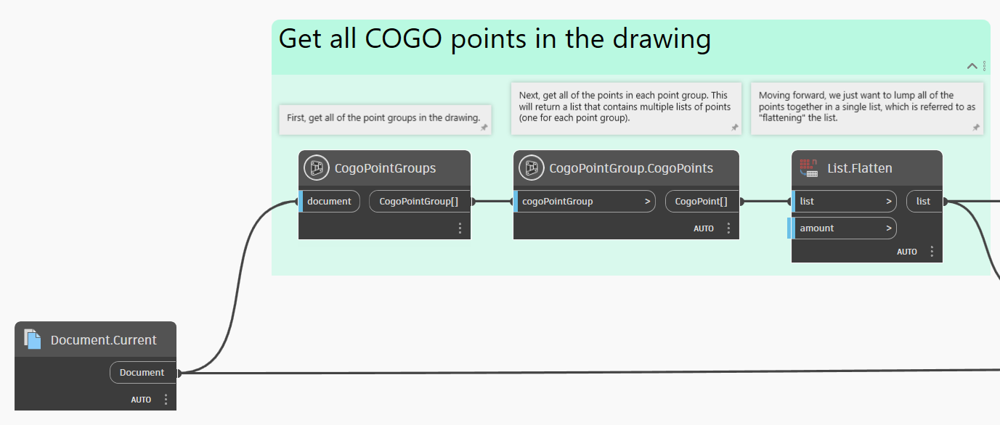
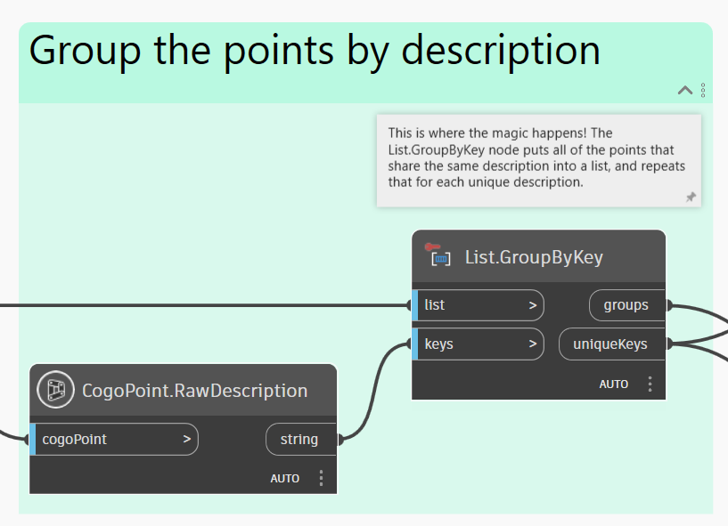
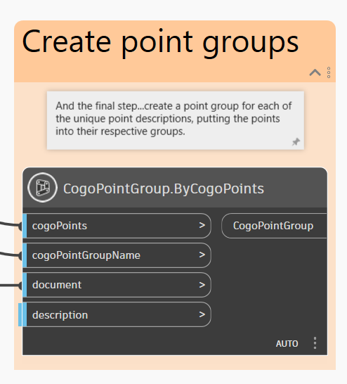
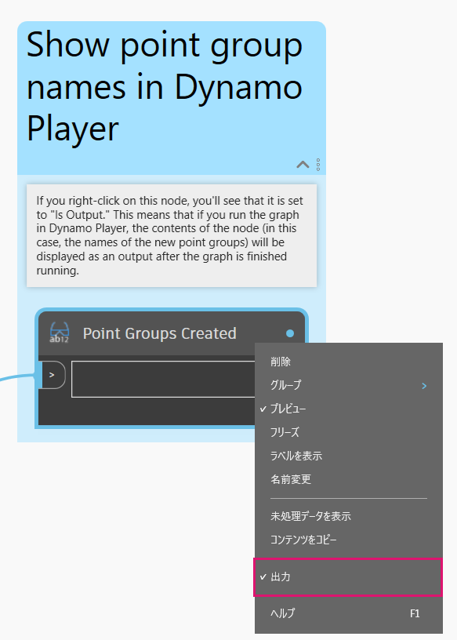

# Administración de grupos de puntos

<figure><figcaption></figcaption></figure>

Trabajar con puntos COGO y grupos de puntos en Civil 3D es un elemento central de muchos procesos de campo al dibujo terminado. Dynamo destaca realmente cuando se trata de la gestión de datos y, en este ejemplo, le mostraremos un posible caso de uso.  

## Objetivo

> :dart: Cree un grupo de puntos para cada descripción de punto COGO exclusiva. 

## Conceptos clave

> * Trabajo con listas
> * Agrupación de objetos similares con el nodo **List.GroupByKey**
> * Visualización de la salida personalizada en el Reproductor de Dynamo

## Compatibilidad con versiones


Este gráfico se ejecutará en **Civil 3D 2020** y versiones posteriores.


## Conjunto de datos

Descargue primero los archivos de ejemplo que aparecen a continuación y abra el archivo DWG y el gráfico de Dynamo.





## Solución

A continuación, se ofrece una descripción general de la lógica de este gráfico.

> 1. Obtener todos los puntos COGO del documento
> 2. Agrupar puntos COGO por descripción
> 3. Crear grupos de puntos
> 4. Generar un resumen en el Reproductor de Dynamo

¡Empecemos!

### Obtener puntos COGO

El primer paso consiste en obtener todos los grupos de puntos del documento y, a continuación, todos los puntos COGO dentro de cada grupo. Esto nos proporcionará una _lista anidada_ o una "lista de listas", con las que será más fácil trabajar más adelante si aplanamos todo hasta una sola lista con el nodo **List.Flatten**.


Si es la primera vez que trabaja con listas, consulte la sección [2-working-with-lists.md](../../../5\_essential\_nodes\_and\_concepts/5-4\_designing-with-lists/2-working-with-lists.md "mention").


<figure><figcaption>
Obtener todos los grupos de puntos y puntos COGO 
</figcaption></figure>

### Agrupar puntos por descripción

Ahora que tenemos todos los puntos COGO, debemos separarlos en grupos en función de sus descripciones. Esto es exactamente lo que hace el nodo **List.GroupByKey**. Básicamente, agrupa todos los elementos que comparten la misma clave.

<figure><figcaption>
Agrupación de puntos COGO por descripción
</figcaption></figure>

### Crear grupos de puntos

Ya se ha completado la parte más complicada. El último paso consiste en crear nuevos grupos de puntos de Civil 3D a partir de los puntos COGO agrupados.

<figure><figcaption>
Crear nuevo grupo de puntos
</figcaption></figure>

### Resumen del resultado

Al ejecutar el gráfico, no hay nada que ver en la vista preliminar en segundo plano de Dynamo porque no estamos trabajando con ninguna geometría. Por lo tanto, la única forma de ver si el gráfico se ha ejecutado correctamente es comprobar el espacio de herramientas o echar un vistazo a las vistas preliminares de salida de los nodos. Sin embargo, si ejecutamos el gráfico con el **Reproductor de Dynamo**, podemos proporcionar más información sobre los resultados del gráfico mediante un resumen de los grupos de puntos que se han creado. Solo hay que hacer clic con el botón derecho en un nodo y establecerlo en _Se genera_. En este caso, se utiliza un nodo **Watch** renombrado para ver los resultados.

<figure><figcaption>
Al establecer un nodo en <em>Se genera</em>, se mostrará su contenido en la salida del Reproductor de Dynamo.
</figcaption></figure>

### Resultado

A continuación, se muestra un ejemplo de cómo ejecutar el gráfico con el **Reproductor de Dynamo**.

<figure><figcaption>
Ejecución del gráfico mediante el Reproductor de Dynamo y visualización de los resultados en el espacio de herramientas
</figcaption></figure>


Si es la primera vez que utiliza el Reproductor de Dynamo, consulte la sección [dynamo-player.md](../../dynamo-player.md "mention").


> :tada: ¡Misión cumplida!

## Ideas

A continuación, se ofrecen algunas ideas sobre cómo podría ampliar las posibilidades de este gráfico.


Modifique la agrupación de puntos para que se base en la **descripción completa** en lugar del código original.



Agrupe los puntos por otras **categorías predefinidas** que elija (por ejemplo, "instantáneas del terreno", "monumentos", etc.)



Cree automáticamente superficies TIN para puntos de determinados grupos.

