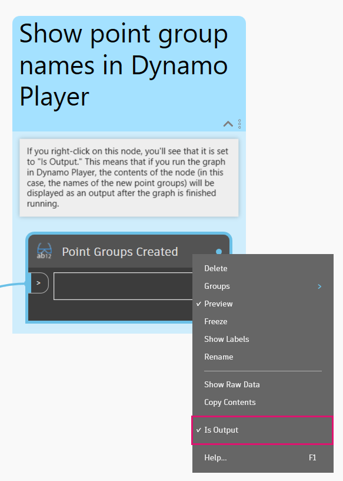

# Point Group Management

<figure><figcaption></figcaption></figure>

Working with COGO Points and Point Groups in Civil 3D is a core element of many field-to-finish processes. Dynamo really shines when it comes to data management, and we'll demonstrate one potential use case in this example. &#x20;

## Goal

> :dart: Create a Point Group for each unique COGO Point description.&#x20;

## Key Concepts

> * Working with Lists
> * Grouping similar objects with the **List.GroupByKey** node
> * Showing custom output in Dynamo Player

## Version Compatibility


This graph will run on **Civil 3D 2020** and above.


## Dataset

Start by downloading the sample files below and then opening the DWG file and Dynamo graph.





## Solution

Here's an overview of the logic in this graph.

> 1. Get all of the COGO Points in the Document
> 2. Group the COGO Points by description
> 3. Create Point Groups
> 4. Output a summary to Dynamo Player

Let's go!

### Get COGO Points

Our first step to get all of the Point Groups in the Document, then get all of the COGO Points within each group. This will give us a _nested list_ or "list of lists," which will be easier to work with later if we flatten everything down to a single list with the **List.Flatten** node.


If you're new to working with Lists, take a look at the [2-working-with-lists.md](../../../5\_essential\_nodes\_and\_concepts/5-4\_designing-with-lists/2-working-with-lists.md "mention") section.


<figure><figcaption>
Get all Point Groups and COGO Points 
</figcaption></figure>

### Group Points by Description

Now that we have all the COGO Points, we need to separate them into groups based on their descriptions. This is exactly what the **List.GroupByKey** node does. It essentially groups together any items that share the same key.

<figure><figcaption>
Grouping the COGO Points by description
</figcaption></figure>

### Create Point Groups

The hard work is done! The final step is to create new Civil 3D Point Groups from the grouped COGO Points.

<figure><figcaption>
Create new Point Groups
</figcaption></figure>

### Output Summary

When you run the graph, there's nothing to see in the Dynamo background preview because we aren't working with any geometry. So the only way to see if the graph executed properly is to check the Toolspace, or to look at the node output previews. However, if we run the graph using **Dynamo Player**, then we can provide more feedback about the graph's results by outputting a summary of the Point Groups that were created. All you have to do is right-click on a node and set it to _Is Output_. In this case, we use a renamed **Watch** node to view the results.

<figure><figcaption>
Setting a node to <em>Is Output</em> will display its contents in the Dynamo Player output
</figcaption></figure>

### Result

Here's an example of running the graph using **Dynamo Player**.

<figure><figcaption>
Running the graph using Dynamo Player and seeing the results in the Toolspace
</figcaption></figure>


If Dynamo Player is new to you, take a look at the [dynamo-player.md](../../dynamo-player.md "mention") section.


> :tada: Mission accomplished!

## Ideas

Here are some ideas for how you could expand the capabilities of this graph.


Modify the point grouping to be based on **full description** instead of raw description.



Group the points by some other **pre-defined categories** that you choose (e.g., "Ground shots," "Monuments," etc.)



Automatically create TIN Surfaces for points in certain groups.

