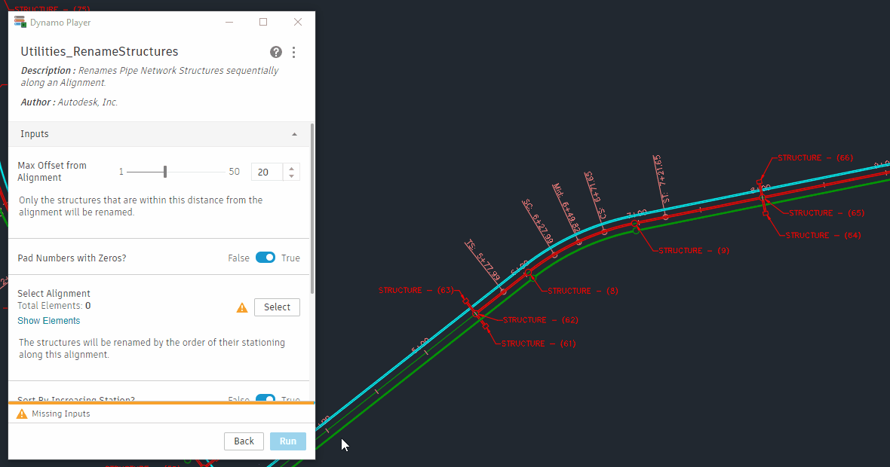

# Renommer des structures

<figure><figcaption></figcaption></figure>

Lors de l’ajout de canalisations et de structures à un réseau de canalisations, Civil 3D utilise un modèle pour attribuer automatiquement des noms. Ceci est généralement suffisant lors du placement initial, mais les noms devront inévitablement être modifiés à l’avenir, au fur et à mesure de l’évolution de la conception. En outre, il existe de nombreux modèles de dénomination différents qui peuvent être nécessaires, par exemple en nommant les structures de manière séquentielle dans un tronçon en commençant par la structure la plus en aval, ou en suivant un modèle de dénomination qui s’aligne sur le schéma de données des autorités locales. Cet exemple montre comment utiliser Dynamo pour définir n’importe quel type de stratégie de dénomination et l’appliquer de manière cohérente.

## Objectif

> :dart: Renommer les structures du réseau de canalisations dans l’ordre en fonction de la cotation des abscisses d’un axe.

## Concepts clés

> * Utiliser des zones de délimitation
> * Filtrer des données à l’aide du nœud **List.FilterByBoolMask**
> * Trier des données à l’aide du nœud **List.SortByKey**
> * Générer et modifier des chaînes de texte

## Compatibilité des versions

 Ce graphique peut s’exécuter dans **Civil 3D 2020** et les versions ultérieures. 

## Ensemble de données

Commencez par télécharger les fichiers d’exemple ci-dessous, puis ouvrez le fichier DWG et le graphique Dynamo.





## Solution

Voici une présentation de la logique de ce graphique.

> 1. Sélectionner les structures par calque
> 2. Obtenir les emplacements de la structure
> 3. Filtrer les structures par décalage, puis les trier par abscisse curviligne
> 4. Générer les nouveaux noms
> 5. Renommer les structures

Allons-y !

### Sélectionner les structures

La première chose à faire est de sélectionner toutes les structures que vous souhaitez utiliser. Pour ce faire, il suffit de sélectionner tous les objets d’un calque donné, ce qui signifie que vous pouvez sélectionner des structures de différents réseaux de canalisations (en supposant qu’elles partagent le même calque).

<figure><figcaption>
Sélection des structures sur un calque donné
</figcaption></figure>

> 1. Ce nœud permet de s’assurer qu’aucun type d’objet indésirable susceptible de partager la même couche que les structures n’est récupéré accidentellement.

### Obtenir les emplacements des structures

Maintenant que vous disposez des structures, vous devez déterminer leur position dans l’espace afin de pouvoir les trier en fonction de leur emplacement. Pour ce faire, vous allez utiliser la zone de délimitation de chaque objet. La **zone de délimitation** d’un objet est la boîte de taille minimale qui contient entièrement l’étendue géométrique de l’objet. En calculant le centre de la zone de délimitation, vous obtenez une assez bonne approximation du point d’insertion de la structure.

<figure><figcaption>
Utilisation de zones de délimitation pour obtenir le point d’insertion approximatif de chaque structure
</figcaption></figure>

Vous utiliserez ces points pour obtenir l’abscisse curviligne et le décalage des structures par rapport à un axe sélectionné.

<figure><figcaption></figcaption></figure>

 

<figure><figcaption></figcaption></figure>

### Filtrer et trier

C’est là que les choses commencent à se compliquer. À ce stade, vous avez une grande liste de toutes les structures du calque que vous avez spécifié et vous avez choisi un axe pour les trier. Cependant, il se peut que la liste contienne des structures que vous ne souhaitez pas renommer. Par exemple, il se peut qu’elles ne fassent pas partie de l’exécution qui nous intéresse.

<figure><figcaption></figcaption></figure>

> 1. Axe sélectionné
> 2. Structures que vous souhaitez renommer
> 3. Structures à ignorer

Vous devez donc filtrer la liste des structures de sorte à ne pas prendre en compte celles qui sont supérieures à un certain décalage par rapport à l’axe. Pour ce faire, il est préférable d’utiliser le nœud **List.FilterByBoolMask**. Après avoir filtré la liste des structures, utilisez le nœud **List.SortByKey** pour les trier en fonction de leurs valeurs d’abscisse curviligne.

 Si vous ne connaissez pas les listes, consultez la section [2-working-with-lists.md](../../../5\_essential\_nodes\_and\_concepts/5-4\_designing-with-lists/2-working-with-lists.md "mention"). 

<figure><figcaption>
Filtrage et tri des structures
</figcaption></figure>

> 1. Vérifier si le décalage de la structure est inférieur à la valeur de seuil
> 2. Remplacer toutes les valeurs nulles par _false_
> 3. Filtrer la liste des structures et des abscisses curvilignes
> 4. Trier les structures par abscisses curvilignes

### Générer de nouveaux noms

La dernière chose à faire est de créer les nouveaux noms des structures. Pour ce faire, vous utiliserez le format `<alignment name>-STRC-<number>`. Quelques nœuds supplémentaires permettent d’ajouter des zéros aux nombres si vous le souhaitez (par exemple, « 01 » au lieu de « 1 »).

<figure><figcaption>
Génération des nouveaux noms de structure
</figcaption></figure>

### Renommer des structures

Enfin, vous renommez les structures.

<figure><figcaption>
Définition des noms des structures
</figcaption></figure>

### Résultat

Voici un exemple d’exécution du graphique à l’aide du **Lecteur Dynamo**.

<figure><figcaption>
Exécution du graphique à l’aide du Lecteur Dynamo et visualisation des résultats dans Civil 3D
</figcaption></figure>

 Si vous ne connaissez pas le Lecteur Dynamo, consultez la section [lecteur-dynamo.md](../../dynamo-player.md "mention"). 

> :tada: Mission accomplie !

### Bonus : visualiser dans Dynamo

Il peut être utile de profiter de l’aperçu de l’arrière-plan en 3D de Dynamo pour visualiser les sorties intermédiaires du graphique au lieu du seul résultat final. Vous pouvez facilement afficher les zones de délimitation des structures. En outre, ce jeu de données particulier contient un projet 3D dans le document, de sorte que nous pouvons importer la géométrie des lignes caractéristiques du terrain du projet 3D dans Dynamo pour fournir un contexte pour l’emplacement des structures dans l’espace. Si le graphique est utilisé sur un jeu de données qui ne possède pas de projet 3D, ces nœuds ne feront rien.

<figure><figcaption>
Visualisation de la géométrie des structures et des lignes caractéristiques du terrain du projet 3D
</figcaption></figure>

Vous comprenez maintenant mieux comment fonctionne le processus de filtrage des structures par décalage.

<figure><figcaption>
Ajustement du seuil de décalage de l’axe et visualisation des structures affectées dans Dynamo
</figcaption></figure>

## Idées

Voici quelques suggestions pour élargir les possibilités offertes par ce graphique.

 Renommez les structures en fonction de leur **axe le plus proche** plutôt que de sélectionner un axe spécifique. 

 **Renommez les canalisations** en plus des structures. 

 **Définissez les calques** des structures en fonction de leur exécution. 
