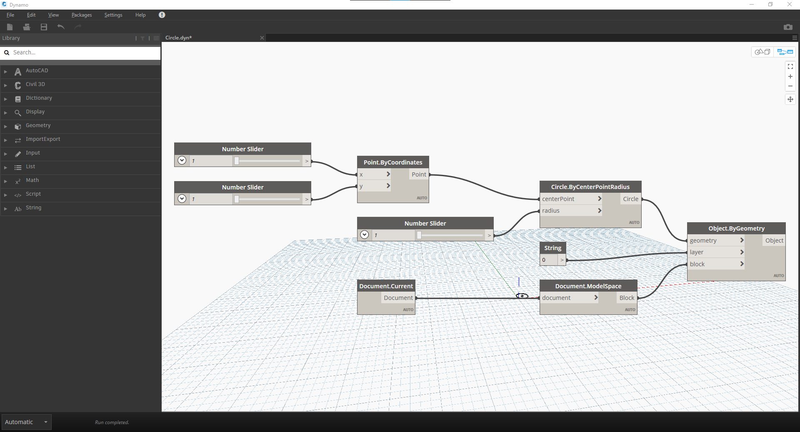
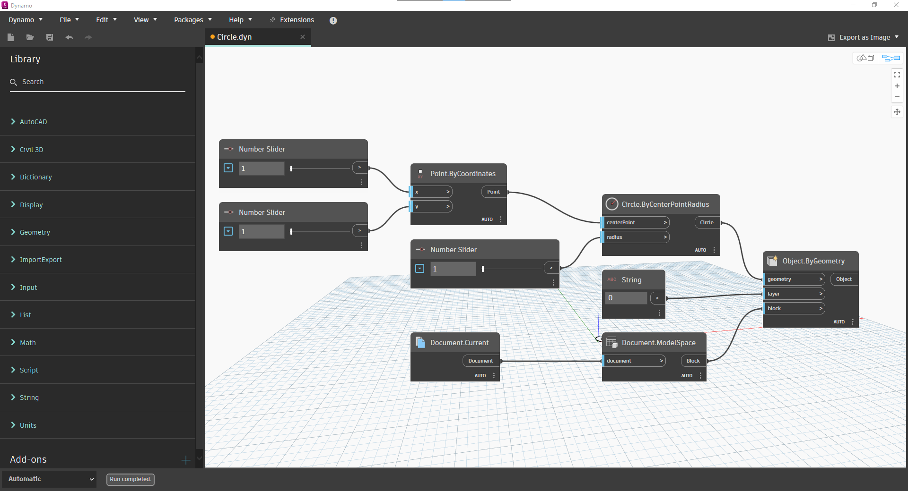

# Civil 3D 연결

<figure><figcaption></figcaption></figure>

Dynamo for Civil 3D는 토목 인프라 프로젝트에 참여하는 엔지니어 및 설계자에게 _시각적 프로그래밍_ 패러다임을 제공합니다. Dynamo는 Civil 3D 사용자를 위한 일종의 디지털 멀티 도구로 생각하면 됩니다. 어떤 작업을 수행하든 작업에 적합한 도구를 제공합니다. 직관적인 인터페이스를 통해 코드를 한 줄도 작성하지 않고도 강력하고 사용자화 가능한 루틴을 작성할 수 있습니다. 프로그래머가 _아니어도_ Dynamo를 사용할 수 있지만, 프로그래머의 논리로 _생각_ 할 수 있어야 합니다. 입문서의 다른 장과 함께, 이 장은 논리 기술을 쌓아 계산 설계 사고방식으로 어떤 작업이든 처리할 수 있도록 도와줍니다.

## 사용 내역

Dynamo는 Civil 3D 2020에서 처음 도입되었으며 그 이후 계속 발전해 왔습니다. 처음에는 소프트웨어 업데이트를 통해 별도로 설치되었지만, 이제는 모든 버전의 Civil 3D에 번들로 제공됩니다. 사용 중인 Civil 3D 버전에 따라 Dynamo 인터페이스가 이 장에 표시된 예와 약간 다르게 보일 수 있습니다. 이는 Civil 3D 2023에서 인터페이스가 크게 변경되었기 때문입니다.

<figure><figcaption>
Dynamo 인터페이스, Civil 3D 2020 - 2022
</figcaption></figure>

<figure><figcaption>
Dynamo 인터페이스, Civil 3D 2023 - 현재
</figcaption></figure>

Dynamo 개발에 관한 최신 정보는 [Dynamo 블로그](https://dynamobim.org/blog/)를 살펴보는 것이 좋습니다. 아래 표에는 Dynamo for Civil 3D의 수명 기간 동안의 주요 이정표가 요약되어 있습니다. 

<table data-full-width="false"><thead><tr><th width="180">Civil 3D 버전</th><th width="161">Dynamo 버전</th><th>주</th></tr></thead><tbody><tr><td>2024.1</td><td>2.18</td><td></td></tr><tr><td>2024</td><td>2.17</td><td>Dynamo 플레이어 사용자 인터페이스 업데이트</td></tr><tr><td>2023.2</td><td>2.15</td><td></td></tr><tr><td>2023</td><td>2.13</td><td>Dynamo 사용자 인터페이스 업데이트</td></tr><tr><td>2022.1</td><td>2.12</td><td><ul><li>객체 바인딩 데이터 저장소 설정 추가</li><li>객체 바인딩 제어를 위한 새로운 노드 추가</li></ul></td></tr><tr><td>2022</td><td>2.10</td><td><ul><li>기본 Civil 3D 설치에 포함됨</li><li>IronPython에서 Python.NET으로 전환</li></ul></td></tr><tr><td>2021</td><td>2.5</td><td></td></tr><tr><td>2020.2</td><td>2.4</td><td></td></tr><tr><td>2020 Update 2</td><td>2.4</td><td>새로운 노드 추가</td></tr><tr><td>2020.1</td><td>2.2</td><td></td></tr><tr><td>2020</td><td>2.1</td><td>초기 릴리즈</td></tr></tbody></table>
