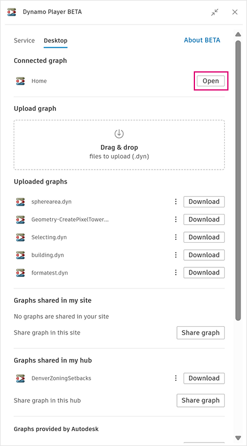
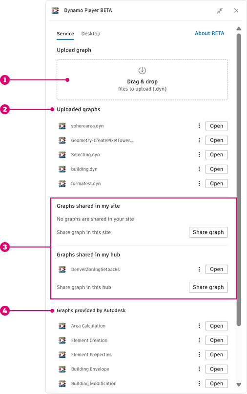
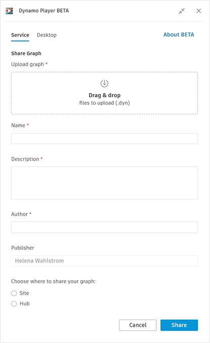

# 在 Dynamo Player 中添加和共享图形

在安装了 Dynamo Player 后，即可在 Player 中打开文件。如果您使用的是桌面版本，还需要打开 Dynamo。&#x20;

<figure><figcaption>
在 Dynamo Desktop 中打开已连接图形
</figcaption></figure>

如果您使用的是 Dynamo Desktop，Player 将识别当前在 Dynamo 中打开的图形，并为您提供在 Player 中打开该图形的选项。

<figure><figcaption></figcaption></figure>

在“服务”和“桌面”选项卡上，您会看到一个标有 **Upload graph** [ 1 ] 的区域，您可以在其中拖放 .dyn 文件以将其添加到 Player。或者，单击该区域以打开用于浏览和添加文件的对话框。

上传的图表显示在 **“Uploaded graphs”**[ 2 ] 下方。您可以打开图形或单击选项菜单（三个点）以删除、下载或共享图形。

图形可以共享到站点或中心 [ 3 ]。一个中心包含多个站点。要共享图形，请单击 **“Share graph”**，然后输入图形详细信息。您可以选择是否将图形共享到站点或中心。单击 **“Share”** 后，有权访问该站点或中心的其他用户将可以使用该图形。

<figure><figcaption>
共享图形
</figcaption></figure>

Dynamo Player 在 **Graphs provided by Autodesk** 部分 [ 4 ] 中提供了几个预构建的图形。这些是探索和实验的一个很好的起点！

