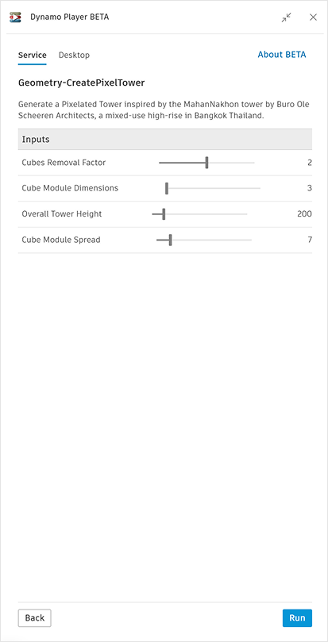
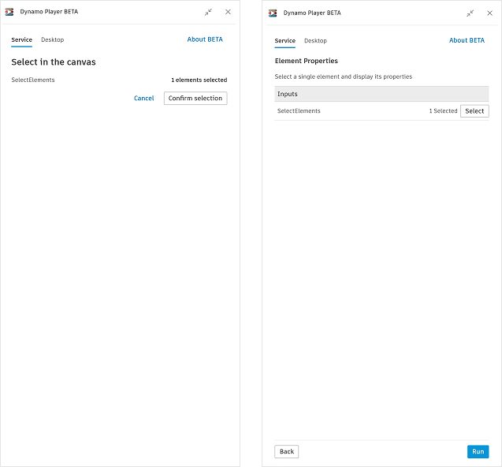
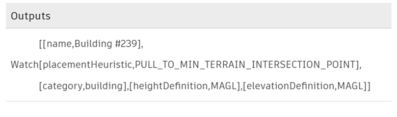
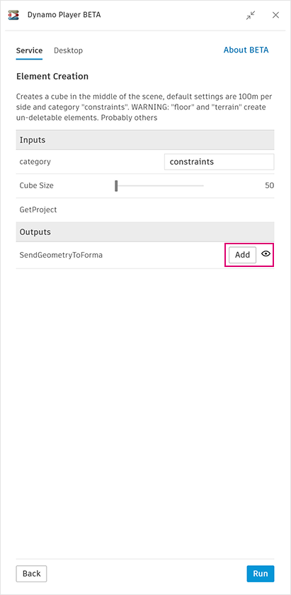

# 在 Dynamo Player 中运行图形

打开图形时，标记为“Is Input”的节点会显示在 Player 中，您可以与其进行交互。

<figure><figcaption></figcaption></figure>

对于某些输入，您将进入选择模式，您可以在其中选择场景中的元素。单击 **“Confirm selection”** 以接受选择并返回以查看图形输入。

<figure><figcaption></figcaption></figure>

在 Player 中单击 **“Run”** 以运行图形。完成后，将显示标记为“是输出”的“Watch”和“Watch 3D”节点，如下所示：

<figure><figcaption></figcaption></figure>

通过生成几何图形的图形，您可以选择预览几何图形并将几何图形添加到站点。单击眼睛图标以打开和关闭预览，然后单击 **“Add”** 以将几何图形添加到您的站点。

<figure><figcaption></figcaption></figure>
