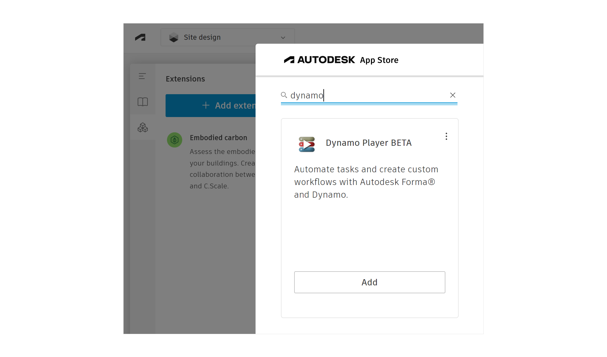
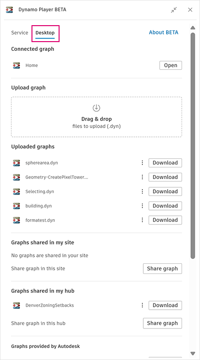

# Einrichten von Dynamo Player in Forma

Für die Verwendung von Dynamo mit Forma haben Sie zwei Möglichkeiten: Cloud-basierte Version Dynamo as a Service (DaaS) oder Desktop-Version von Dynamo. Jede Version hat ihre Vorteile, je nachdem, welche Aufgaben Sie ausführen möchten. Überlegen Sie also vor Beginn, welche Option Ihren Anforderungen am besten entspricht. Beachten Sie jedoch, dass Sie jederzeit zwischen diesen Optionen wechseln können.

**Vergleich von Dynamo as a Service und Dynamo Desktop**

<table><thead><tr><th>Dynamo as a Service</th><th>Desktop</th><th data-hidden></th></tr></thead><tbody><tr><td>Einfache Einrichtung</td><td>Installation in mehreren Schritten</td><td></td></tr><tr><td>Dynamo muss sind installiert oder geöffnet sein</td><td>Dynamo muss geöffnet sein</td><td></td></tr><tr><td>Erkennt keine Diagramme, die bereits in Dynamo geöffnet sind</td><td>Öffnen eines in Dynamo geöffneten Diagramms mit nur einem Mausklick im Player</td><td></td></tr><tr><td>Python kann nicht verwendet werden</td><td>Python kann verwendet werden</td><td></td></tr><tr><td>Es können nur sanktionierte Pakete verwendet werden</td><td>Beliebiges Paket kann verwendet werden</td><td></td></tr></tbody></table>

Auf dieser Seite wird erläutert, wie Sie beide Optionen einrichten.

### Einrichten von Dynamo as a Service

Dynamo in Forma Beta ist derzeit als offene Beta-Version mit Exklusivzugriff verfügbar. Dies bedeutet, dass sich Funktionen und Benutzeroberfläche regelmäßig ändern können.

Installieren Sie zunächst Dynamo Player in Forma.

1. Wechseln Sie in Ihrer Forma-Site in der linken Seitenleiste zu **Extensions**, und klicken Sie auf **Add extension**. Der Autodesk App Store wird geöffnet.
2. Suchen Sie nach Dynamo, und fügen Sie Dynamo Player Beta hinzu. Lesen Sie den Haftungsausschluss und klicken Sie auf **Agree**.

<figure><figcaption></figcaption></figure>

3. Jetzt steht Dynamo Player in Ihren Erweiterungen zur Verfügung. Klicken Sie darauf, um diesen zu öffnen.
4. Sie können Dynamo Player nun verwenden.

### Einrichten von Dynamo Desktop

Um Dynamo Desktop zu verwenden, benötigen Sie Dynamo, entweder als eigenständige Sandbox oder in Verbindung mit Revit oder Civil 3D. Außerdem benötigen Sie das DynamoFormaBeta-Paket.

#### Revit

Folgen Sie diesen Anweisungen, um Dynamo in Revit und das DynamoFormaBeta-Paket einzurichten.

1. Stellen Sie sicher, dass Sie Revit 2024.1 oder höher installiert haben.
2. Öffnen Sie Dynamo über Revit, indem Sie auf Verwalten > Dynamo klicken.
3. Installieren Sie in Dynamo das DynamoFormaBeta-Paket. Wechseln Sie zu Pakete > Package Manager, und suchen Sie nach DynamoFormaBeta.
   1. Wenn Sie Revit 2024 nutzen, installieren Sie das DynamoFormaBeta for 2.x-Paket.
   2. Wenn Sie Revit 2025 nutzen, installieren Sie das DynamoFormaBeta-Paket.

#### Civil 3D

Folgen Sie diesen Anweisungen, um Dynamo in Civil 3D und das DynamoFormaBeta-Paket einzurichten.

1. Stellen Sie sicher, dass Sie Civil 3D 2024.1 oder höher installiert haben.
2. Öffnen Sie Dynamo über Civil 3D, indem Sie auf Verwalten > Dynamo klicken.
3. Installieren Sie in Dynamo das DynamoFormaBeta-Paket. Wechseln Sie zu Pakete > Package Manager, und suchen Sie nach DynamoFormaBeta.
   1. Wenn Sie Civil 3D 2024 nutzen, installieren Sie das DynamoFormaBeta for 2.x-Paket.
   2. Wenn Sie Civil 3D 2025 nutzen, installieren Sie das DynamoFormaBeta-Paket.

#### Dynamo Sandbox

Folgen Sie diesen Anweisungen, um Dynamo Sandbox und das DynamoFormaBeta-Paket zu installieren.

1. Laden Sie Dynamo 2.18.0 oder höher von [Dynamo Builds](https://dynamobuilds.com/) herunter. Um optimal arbeiten zu können, wählen Sie die neuesten der stabilsten Versionen aus, die oben aufgeführt sind.
   1. Die täglichen Versionen sind Entwicklungsversionen und können unvollständige oder in Bearbeitung befindliche Funktionen enthalten.
2. Extrahieren Sie Dynamo mit [7zip](https://www.7-zip.de/) in einen Ordner Ihrer Wahl.
3. Führen Sie DynamoSandbox.exe im Dynamo-Installationsordner aus.
4. Installieren Sie in Dynamo das DynamoFormaBeta-Paket. Wechseln Sie zu Pakete > Package Manager, und suchen Sie nach DynamoFormaBeta.
   1. Wenn Sie Dynamo 2.x nutzen, installieren Sie das DynamoFormaBeta for 2.x-Paket.
   2. Wenn Sie Dynamo 3.x nutzen, installieren Sie das DynamoFormaBeta-Paket.

Sobald Dynamo installiert ist, können Sie die Anwendung mit Forma verwenden. Wenn Sie die Desktop-Option von Dynamo in Forma ausführen, muss Dynamo geöffnet sein, um die Dynamo Player Extension verwenden zu können.

#### Zugriff auf Dynamo Desktop in Forma

Installieren Sie zunächst Dynamo Player in Forma.

1. Wechseln Sie in Ihrer Forma-Site in der linken Seitenleiste zu **Extensions**, und klicken Sie auf **Add extension**. Der Autodesk App Store wird geöffnet.
2. Suchen Sie nach Dynamo, und fügen Sie Dynamo Player Beta hinzu. Lesen Sie den Haftungsausschluss und klicken Sie auf **Agree**.

<figure><figcaption></figcaption></figure>

3. Jetzt steht Dynamo Player in Ihren Erweiterungen zur Verfügung. Klicken Sie darauf, um diesen zu öffnen.
4. Klicken Sie oben auf Desktop, um auf Dynamo Desktop zuzugreifen.

<figure><figcaption></figcaption></figure>

5. Sie können Dynamo Player nun verwenden. Wenn Sie bereits ein Diagramm in Dynamo geöffnet haben, klicken Sie einfach unter **Connected graph** auf Open, um es im Player anzuzeigen.
