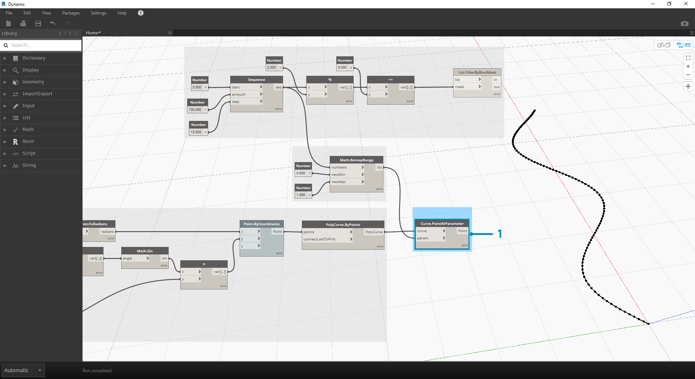
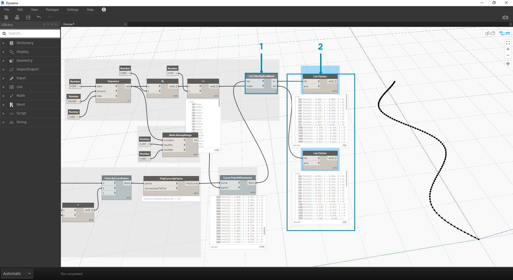
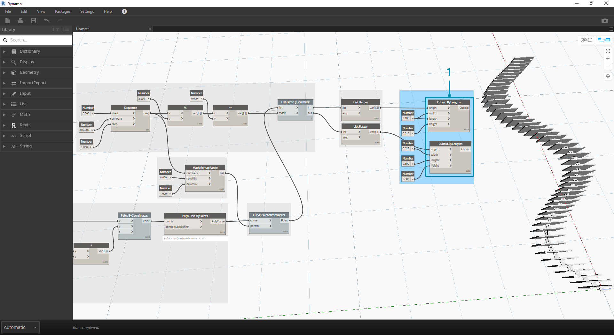
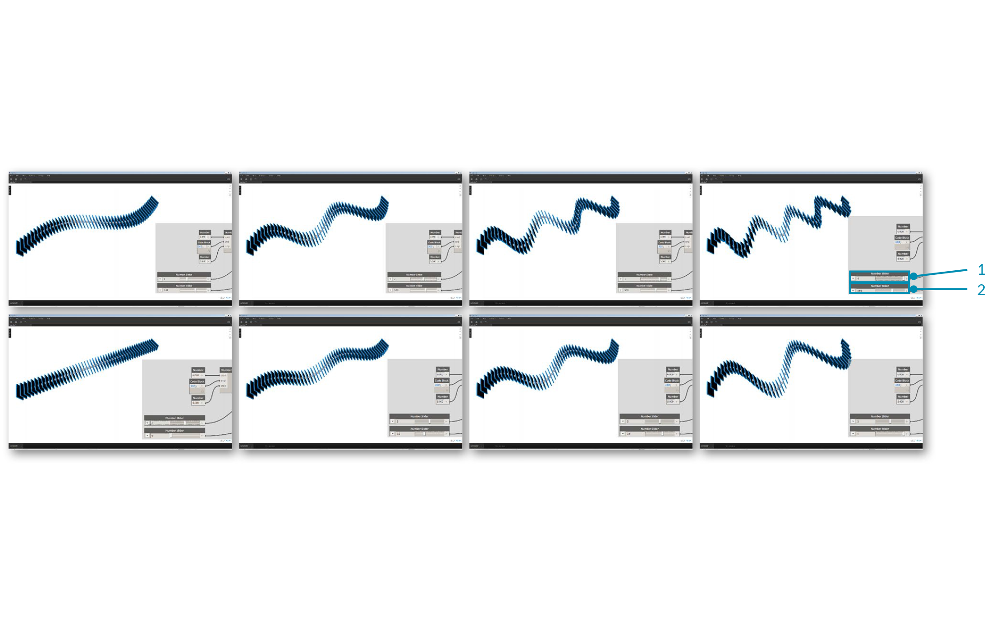

# Logic

**Logic**, or more specifically, **Conditional Logic**, allows us to specify an action or set of actions based on a test. After evaluating the test, we will have a Boolean value representing `True` or `False` that we can use to control the Program Flow.

### Booleans&#x20;

Numeric variables can store a whole range of different numbers. Boolean variables can only store two values referred to as True or False, Yes or No, 1 or 0. We rarely use booleans to perform calculations because of their limited range.

### Conditional Statements&#x20;

The "If" statement is a key concept in programming: "If _this_ is true, then _that_ happens, otherwise _something else_ happens. The resulting action of the statement is driven by a boolean value. There are multiple ways to define an "If" statement in Dynamo:

| Icon                                            | Name & Syntax           | Inputs            | Outputs |
| ----------------------------------------------- | ----------------------- | ----------------- | ------- |
| .jpg>)         | If (**If**)             | test, true, false | result  |
|           | Formula (**IF(x,y,z)**) | x, y, z           | result  |
| .jpg>) | Code Block (**x:y:z**)  | x? y, z           | result  |

Let's go over a brief example on each of these three nodes in action using the conditional "If" statement:

> In this image, the _boolean_ is set to _true_, which means that the result is a string reading: _"this is the result if true"._ The three Nodes creating the _If_ statement are working identically here.

> Again, the Nodes are working identically. If the _boolean_ is changed to _false_, our result is the number _Pi_, as defined in the original _If_ statement.

## Exercise: Logic and Geometry

### Part I: Filtering a List

> Download the example file that accompanies this exercise (Right click and "Save Link As..."): \[Building Blocks of Programs - Logic.dyn]
>
> A full list of example files can be found in the Appendix.

Let's use logic to separate a list of numbers into a list of even numbers and a list of odd numbers.

a. **Number Range -** add a number range to the canvas.

b. **Numbers -** add three number nodes to the canvas. The value for each number node should be: _0.0_ for _start_, _10.0_ for _end_, and _1.0_ for _step_.

c. **Output** - our output is a list of 11 numbers ranging from 0-10.

d. **Modulo (%)-** _Number Range_ into _x_ and _2.0_ into _y_. This calculates the remainder for each number in the list divided by 2. The output from this list gives us a list of values alternating between 0 and 1.

e. **Equality Test (==) -** add an equality test to the canvas. Plug _modulo_ output into the _x_ input and _0.0_ into the _y_ input.

f. **Watch -** The output of the equality test is a list of values alternating between true and false. These are the values used to separate the items in the list. _0_ (or _true_) represents even numbers and (_1_, or _false_) represents odd numbers.

g. **List.FilterByBoolMask -** this Node will filter the values into two different lists based on the input boolean. Plug the original _number range_ into the _list_ input and the _equality test_ output into the _mask_ input. The _in_ output represents true values while the _out_ output represents false values.

h. **Watch** - as a result, we now have a list of even numbers and a list of odd numbers. We've used logical operators to separate lists into patterns!

### Part II: From Logic to Geometry&#x20;

Building off of the logic established in the first exercise, let's apply this setup into a modeling operation.

.png>)&#x20;

\We'll jump off from the previous exercise with the same Nodes. The only exceptions (in addition to changing the format are):

> 3\. The input values have changed.

1. We've unplugged the in list input into _List.FilterByBoolMask_. We'll put these Nodes aside for now, but they'll come in handy later in the exercise.

.png>)

> Let's begin by connecting the Nodes together as shown in the image above. This group of Nodes represents a parametric equation to define a line curve. A few notes:

1. The **first slider** should have a min of 1, a max of 4, and a step of 0.01.
2. The **second slider** should have a min of 0, a max of 1, and a step of 0.01.
3. **PolyCurve.ByPoints -** if the above Node diagram is copied, the result is a sine curve in the Dynamo Preview viewport.

The method here for the inputs: use number nodes for more static properties and number sliders on the more flexible ones. We want to keep the original number range that we're defining in the beginning of this step. However, the sine curve that we create here should have some flexibility. We can move these sliders to watch the curve update its frequency and amplitude.

> We're going to jump around a bit in the definition, so let's look at the end result so that we can reference what we're getting at. The first two steps are made separately, we now want to connect the two. We'll use the base sine curve to drive the location of the zipper components, and we'll use the true/false logic to alternate between little boxes and larger boxes.

.png>)

> 1. \*\*Math.RemapRange - \*\* Using the number sequence created in step 01, let's create a new series of numbers by remapping the range. The original numbers from step 01 range from 0-100. These numbers range from 0 to 1 by the _newMin_ and _newMax_ inputs respectively.

> 1. \*\*Curve.PointAtParameter - \*\* Plug _Polycurve.ByPoints_ (from step 2) into _curve_ and _Math.RemapRange_ into _param_. This step creates points along the curve. We remapped the numbers to 0 to 1 because the input of _param_ is looking for values in this range. A value of _0_ represents the start point, a value of _1_ represents the end points. All numbers in between evaluate within the _\[0,1]_ range.

> 1. \*\*List.FilterByBoolMask - \*\* Plug _Curve.PointAtParameter_ from the previous step into the _list_ input.

1. **Watch -** a watch node for _in_ and a watch node for _out_ shows that we have two lists representing even indices and odd indices. These points are ordered in the same way on the curve, which we demonstrate in the next step.

> 1. **Cuboid.ByLengths -** recreate the connections seen in the image above to get a zipper along the sine curve. A cuboid is just a box here, and we're defining its size based on the curve point in the center of the box. The logic of the even/odd divide should now be clear in the model.

> 1. **Number Slider -** stepping back to the beginning of the definition, we can flex the number slider and watch the zipper update. The top row of images represents a range values for the top number slider. This is the frequency of the wave.

1. **Number Slider -** the bottom row of images represents a range of values for the bottom slider. This is the amplitude of the wave.
