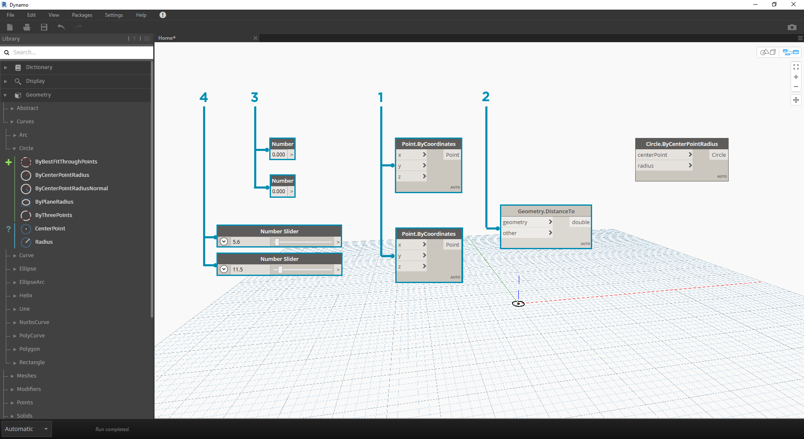
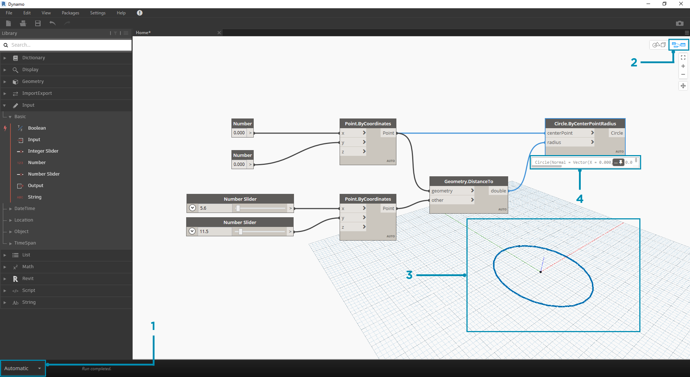
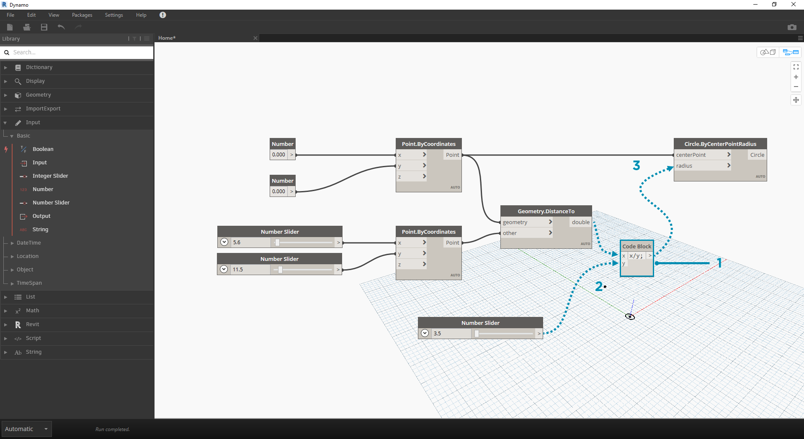
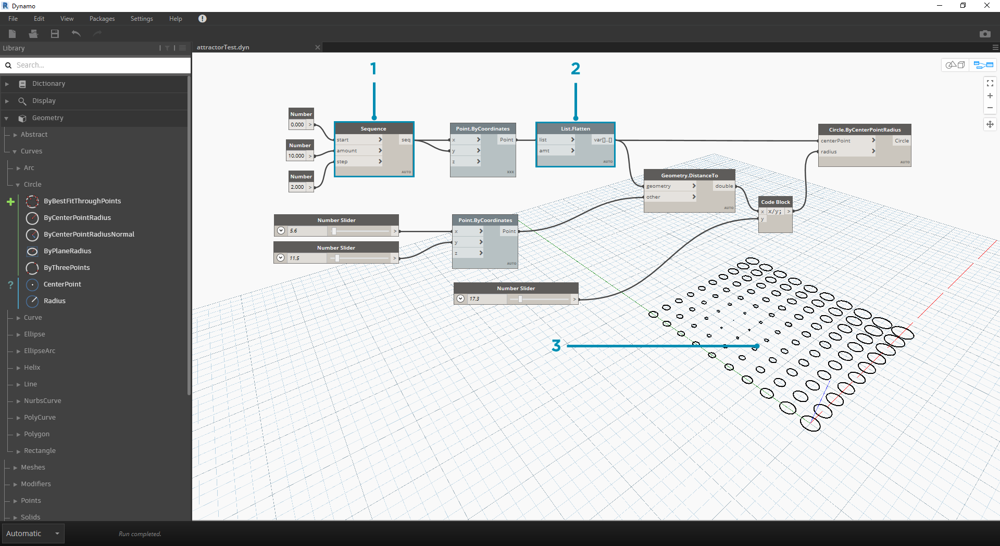

# Attractor Points

Attractor points are great for experimenting with geometric patterns. They can be used to create gradual changes to objects based on their distance.

This workflow will teach you how to:

* Deal with lists
* Move a point using direct manipulation.
* sdcsdc

## Defining our Objectives 

In this exercise, we want to create a circle (_Objective_) where the radius input is defined by a distance to a nearby point (_Relationship_).

> A point that defines a distance-based relationship is commonly referred to as an "Attractor." Here the distance to our Attractor Point will be used to specify how big our circle should be.

## Next steps 

Now that we have our objectives and relationships sketched we can begin creating our graph. We need the Nodes that will represent the sequence of actions Dynamo will execute. Let's start by adding the following nodes: **Number**, **Number Slider**, **Point.ByCoordinates**, **Geometry.DistanceTo, Circle.ByCenterPointRadius.**

> 1. Input > Basic > **Number**
> 2. Input > Basic > **Number Slider**
> 3. Geometry > Points > Point > **By Coordinates(x,y,z)**
> 4. Geometry > Modifiers > Geometry > **DistanceTo**
> 5. Geometry > Curves > Circle > **ByCenterPointRadius**

### Connecting Nodes with Wires 

Now that we have a few Nodes, we need to connect the Ports of the Nodes with Wires. These connections will define the flow of data.

> 1. **Number** to **Point.ByCoordinates**
> 2. **Number Sliders** to **Point.ByCoordinates**
> 3. **Point.ByCoordinates** (2) to **DistanceTo**
> 4. **Point.ByCoordinates** and **DistanceTo** to **Circle.ByCenterPointRadius**

### Executing the Program 

With our Program Flow defined, all we need to do is tell Dynamo to execute it. Once our program is executed (either Automatically or when we click Run in Manual Mode), data will pass through the Wires, and we should see the results in the 3d Preview.

> 1. (Click Run) - If the Execution Bar is in Manual Mode, we need to Click Run to execute the graph
> 2. Node Preview - Hovering your mouse over the box on the lower right corner of a Node will give you a pop-up of the results
> 3. 3D Preview - If any of our Nodes create geometry, we will see it in the 3D Preview.
> 4. The output geometry on the creation node.

### Adding Detail 

If our program is working, we should see a circle in the 3D Preview that is passing through our Attractor Point. This is great, but we may want to add more detail or more controls. Let's adjust the input to the circle Node so that we can calibrate the influence on the radius. Add another **Number Slider** to the Workspace, then double click on a blank area of the Workspace to add a **Code Block** Node. Edit the field in the Code Block, specifying `X/Y`.

> 1. **Code Block**

1. **DistanceTo** and **Number Slider** to **Code Block**
2. **Code Block** to **Circle.ByCenterPointRadius**

### Adding complexity 

Starting simple and building complexity is an effective way to incrementally develop our program. Once it is working for one circle, let's apply the power of the program to more than one circle. Instead of one center point, if we use a grid of points and accommodate the change in the resulting data structure, our program will now create many circles - each with a unique radius value defined by the calibrated distance to the Attractor Point.

> 1. Add a **Number Sequence** Node and replace the inputs of **Point.ByCoordinates** - Right Click Point.ByCoordinates and select Lacing > Cross Reference

1. Add a **Flatten** Node after Point.ByCoordinates. To flatten a list completely, leave the `amt` input at the default of `-1`
2. The 3D Preview will update with a grid of circles

### Adjusting with Direct Manipulation 

Sometimes numerical manipulation isn't the right approach. Now you can manually push and pull Point geometry when navigating in the background 3D preview. We can also control other geometry that was constructed by a point. For example, **Sphere.ByCenterPointRadius** is capable of Direct Manipulation as well. We can control the location of a point from a series of X, Y, and Z values with **Point.ByCoordinates**. With the Direct Manipulation approach, however, you are able to update the values of the sliders by manually moving the point in the **3D Preview Navigation** mode. This offers a more intuitive approach to controlling a set of discrete values that identify a point's location.

> 1. To use **Direct Manipulation**, select the panel of the point to be moved – arrows will appear over the point selected.

1. Switch to **3D Preview Navigation** mode.

> 1. Hover over the point and the X, Y, and Z axes will appear.

1. Click and drag the colored arrow to move the corresponding axis, and the **Number Slider** values will update live with the manually moved point.

> 1. Note that before **Direct Manipulation** only one slider was plugged into the **Point.ByCoordinates** component. When we manually move the point in the X-direction, Dynamo will automatically generate a new **Number Slider** for the X input.

## Expanding your Workflow

 (1).png>)
