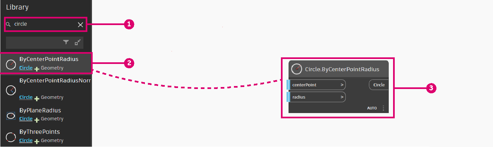
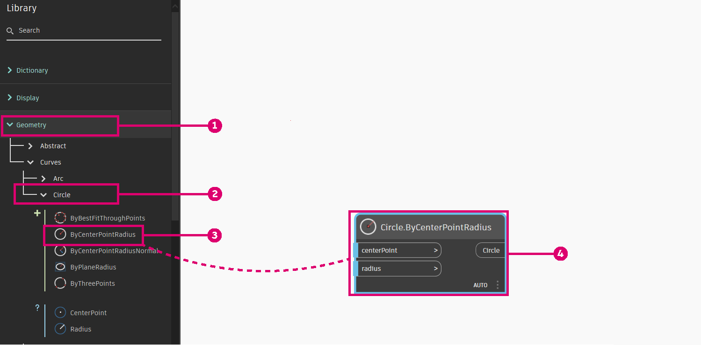
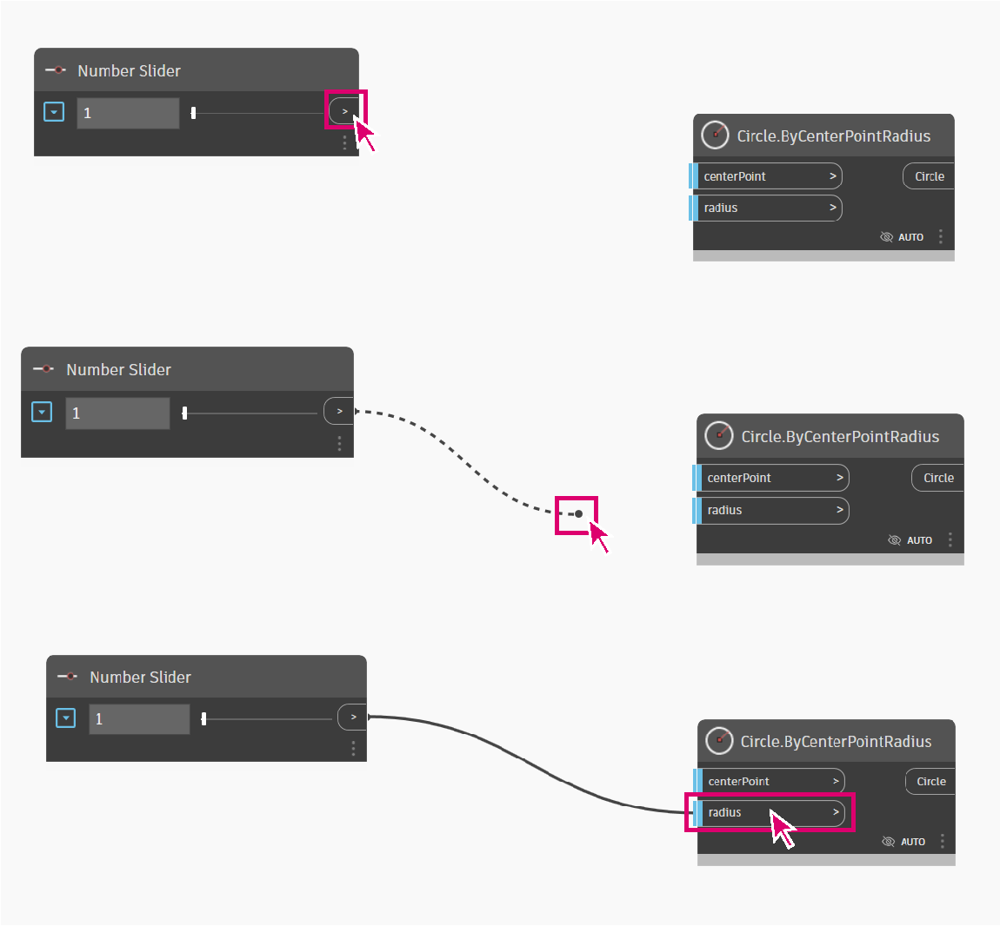

# Parametric Vase

Creating a parametric vase is a great way to start learning key visual programming concepts needed to use Dynamo.&#x20;

This workflow will teach you how to:

* Use number sliders to control variables in your design.
* Create and modify geometry elements using nodes
* &#x20;Visualize design results in real-time.

.gif>)

## Defining Our Vase

Before jumping into dynamo let's conceptually design our vase.&#x20;

Let's say we are going to design a clay vase that takes into account manufacturing practices used by ceramists. Ceramists usually use a pottery wheel to fabricate cylindrical vases. Then, by applying pressure on various heights of the vase they can alter the shape of the vase and create varied designs.   &#x20;

We would use a similar methodology to define our vase. We will create 4 circles at different heights and radii and we will then create a surface by lofting those circles.

## Getting Started

We need the **nodes** that will represent the sequence of actions Dynamo will execute. Since we know we are trying to create a circle, let's start by locating a node that does so. Using the **Search field** or browsing through the Library, we will find that there is more than one way to create a circle.

> Search > "Circle..."

> Browse to Geometry > Circle > **ByCenterPointRadius**

Let's add the **Circle.ByCenterPointRadius** Node to the Workspace by clicking on it in the Library - this should add the Node to the center of the Workspace.

Let's take a look at this node to get more information about it. On the left side, you have the node's inputs (centerPoint and radius) and on the right side, you have the node's output (Circle). Notice that the outputs have a light blue line? this means that the input has a default value. To get more information about the input hover over its name.&#x20;

We will leave the default value of centerPoint but add a **number slider** to control the radius. As we did with the Circle.ByCenterPointRadius node, use the library to search for Number Slider and add it to your graph.

This node is a bit different than our previous node as it contains a slider. The slider can be configured using the dropdown button at the left of the node. Let's limit the slider to a maximum value of 15.

Let's place it on the left of our Circle.ByCenterPointRadius node and connect both nodes by selecting the Number Slider output and connecting it to the Radius input.

## Next steps

Let's continue adding our logic to define our base.

### Creating Circles of Different Radii

Let's copy these nodes 4 times as these circles will define our surface.

.png>)

> 1. Circles are created by a center point and a radius

### Moving Circles Through the Vase Height

We are missing a key parameter to our vase, its height. In order to control the height, we create another number slider. We then use a **Geometry.Translate** node to place circles at the desired height. Since we want to distribute our circles through the vase we use code blocks to multiply the height parameter by a factor.

.png>)

> 2\. Circles are translated (moved) by a variable in the z axis.

### Creating the Surface

In order to create a surface using the **Surface.ByLoft** node we need to combine all of our translated circles into a list. We use the **List.Create** to combine all of our circles into a single list, and then finally output this list to the **Surface.ByLoft** node to view results.

Let's also turn off the preview in other nodes to only display the Surface.ByLoft display.

.png>)

> 3\. A surface is created by lofting the translated circles.&#x20;

## Results

We can now use the **Number Sliders** we defined in our script to create different vase designs.&#x20;

