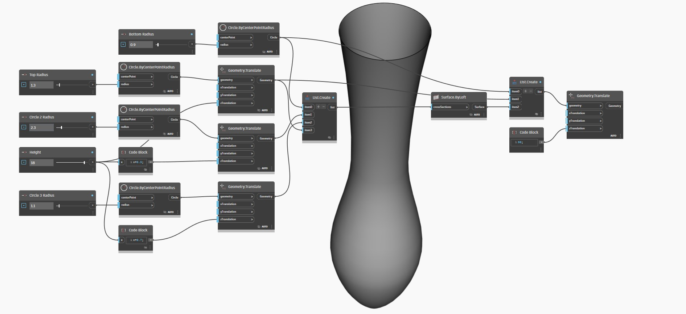

# Parametric Vase

Creating a parametric vase is a great way to start learning key visual programming concepts needed to use Dynamo.&#x20;

This workflow will teach you how to:

* Use number sliders to control variables in your design.
* Create and modify geometry elements using nodes
* &#x20;Visualize design results in real-time.

## Designing Our Vase

Before jumping into dynamo let's conceptually design our vase.&#x20;

Let's say we are going to design a clay vase that takes into account manufacturing practices used by ceramists. Ceramists usually use a pottery wheel to fabricate cylindrical vases. Then, by applying pressure on various heights of the vase they can alter the shape of the vase and create varied designs.   &#x20;

We would use a similar methodology to define our vase. We will create 4 circles at different heights and radii and we will then create a surface by lofting those circles.

## Basic steps

### Creating Circles of Different Radii

In order to create a circle we will use the **Circle.ByCentrePointRadius** node. This node has a default center point and radius.&#x20;

We will create a slider to manipulate the radius and leave the center point to its default value. Let's also change the slider's maximum to 15 to make it easier to control.&#x20;

Now, let's copy these nodes 4 times as these circles will define our surface.

### Moving Circles Through the Vase Height

We are missing a key parameter to our vase, its height. In order to control the height, we create another number slider.

We then use a **Geometry.Translate** node to place circles at the desired height. Since we want to distribute our circles through the vase we use code blocks to multiply the height parameter by a factor.

### Creating the Surface

In order to create a surface using the **Surface.ByLoft** node we need to combine all of our translated circles into a list. We use the **List.Create** to combine all of our circles into a single list, and then finally output this list to the **Surface.ByLoft** node to view results.

Let's also turn off the preview in other nodes to only display the Surface.ByLoft display.

ASxasxasx
